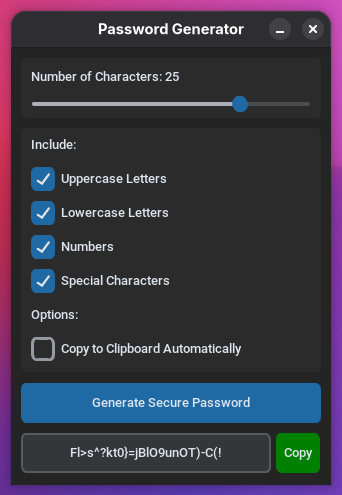

# Password-Generator

A simple Password Generator with GUI in Python using CustomTkinter

- Generate secure random passwords
- Simple and user-friendly GUI
- Customizable password length
- Option to include letters, numbers, and special characters
- One-click copy to clipboard
- No installation required (portable executable)
